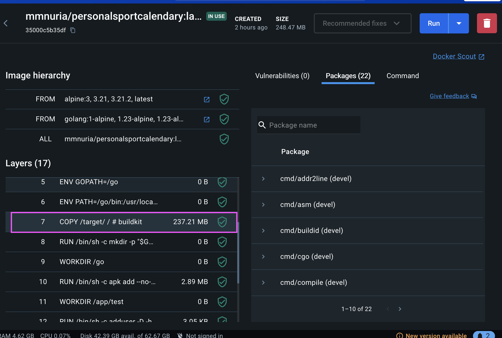

# Requisitos buscados para la imagen para el contenedor
1. Tamaño reducido: Ha de contar con las mínimas dependencias necesarias para funcionar, de forma que la imagen tenga un tamaño reducido, haciendo un uso eficiente del espacio disponible. Esto también reduce la exposición a riesgos de seguridad: al incluir sólo lo estrictamente necesario, se reduce la cantidad de fallos de seguridad originados en las dependencias instaladas como consecuencia de la reducción del número de estas.
2. Mantenimiento activo: Imagen actualizada para prevenir la deuda técnica. Se comprueba en Docker Hub cuanto hace que se actualizó la imagen.

## Opciones disponibles

- **[Golang](https://hub.docker.com/_/golang)**:
Esta imagen es la opción oficial, viene con Go instalado por defecto, eliminando la necesidad de configurarlo manualmente. Además, se mantiene actualizada con regularidad. Para una optimización adicional, puede escogerse la versión que usa Alpine cómo sistema operativo, lo que reduce considerablemente el tamaño (en su variante Alpine ocupa alrededor de 250MB respecto a su versión estándar que ocupa 837MB). Última actualización fue hace menos de 2 semanas.

- **[Alpine](https://hub.docker.com/_/alpine)**: 
Alpine es una de las imágenes más ligeras que se puede usar, destacándose por su tamaño reducido. Sin embargo, su principal inconveniente es que no viene con Go preinstalado, por lo que se necesitará instalarlo y configurarlo. Pesan entorno a los 8MB de base. Última actualización hace menos de 3 semanas.

- **[Ubuntu](https://hub.docker.com/_/ubuntu)**: Imagen oficial de Ubuntu, una distribución de Linux popular y ampliamente utilizada. No incluye Go preinstalado, por lo que sería necesario instalarlo manualmente. Se actualiza regularmente junto con las versiones de Ubuntu. Pesan entorno a los 78MB. Última actualización hace 2 meses.

- **[Bitnami Golang](https://hubgw.docker.com/r/bitnami/golang)**: Bitnami proporciona imágenes de aplicaciones listas para producción. Las imágenes se mantienen actualizadas regularmente y pesan entorno a 682MB. Última actualización hace menos de 2 días.

- **[Okteto Golang](https://github.com/okteto/okteto)**: Okteto ofrece una imagen de Go preparada para el desarrollo en la nube, incluyendo herramientas adicionales para facilitar la integración y el despliegue. Las imágenes de Okteto se actualizan con regularidad para incluir las últimas versiones de Go y herramientas relacionadas. Pesan entorno a 1,66GB. Última actualización hace 2 semanas.

- **[Circleci Golang](https://hubgw.docker.com/r/circleci/golang)**: CircleCI proporciona imágenes de Go para integraciones continuas, incluyendo herramientas necesarias para pipelines de CI/CD. Pesan entorno a 2.47GB y no reciben actualizaciones desde hace 3 años.

## Opción escogida
Entre las opciones a considerar, las más ligeras son **Golang** (en su versión con Alpine), **Alpine** y **Ubuntu**. El resto ocupan al menos más del doble que la más ligera de estas tres mencionadas y por tanto, se descartan. Además la de **CircleCI** ya no está mantenida.

Dentro de estas tres opciones más ligeras, cabe tener en cuenta que **Alpine** y **Ubuntu** pesan bastante menos de partida, no obstante hay un factor a considerar para obtener realmente su tamaño final: Go no viene instalado. 

Aunque el hecho de tener que configurarlo es un factor secundario (pues una vez configurado, si su tamaño es menor, el beneficio derivado va a merecer la pena cada vez que se instancia un contenedor), su instalación también incrementa el tamaño de ambas imágenes considerablemente llevándonos a la siguiente situación:

- **Alpine**: Pasa de pesar 7.83MB a 250MB, incluso descargando los [binarios](https://go.dev/dl/) de Go y de Just en una primera etapa y copiándolos a la imagen de Alpine en la segunda.
- **Ubuntu**: Pasa de pesar 78.12MB a 323MB, de nuevo, descargando los binarios de Go y de Just en una primera etapa y copiándolos a la imagen de Ubuntu en la segunda
- **Golang** (variante Alpine): Pasa de pesar 245MB a 248.47MB, en este caso sólo hace falta descargar Just, Go ya viene incluido.

En los tres casos la problemática es la misma: los binarios de Go que se descargan pesan lo mismo y por tanto la diferencia de tamaño en este caso termina haciéndola la imagen base sobre la que construimos la del proyecto. 

Peso de las capas en Ubuntu:

Peso de las capas en Alpine:

Peso de las capas en Golang-Alpine:

Es por ello que finalmente de entre estas tres, se escoge Golang Alpine: Ubuntu pesa más y construirla desde Alpine induce algo de deuda técnica ya que hace falta descargar los binarios con la versión del lenguaje explícitamente seleccionada, lo que puede hacer que con el paso del tiempo y las actualizaciones, nuestra imagen se quede desfasada respecto a la última versión de Go, acumulando errores que son resueltos en actualizaciones posteriores. Por otro lado, Golang Alpine tambien cumple con el criterio establecido de imagen actualizada, siendo ésta la opción más válida para el proyecto.

Al quedarnos con **Golang Alpine** siempre tenemos la versión de Go más reciente montada sobre Alpine.